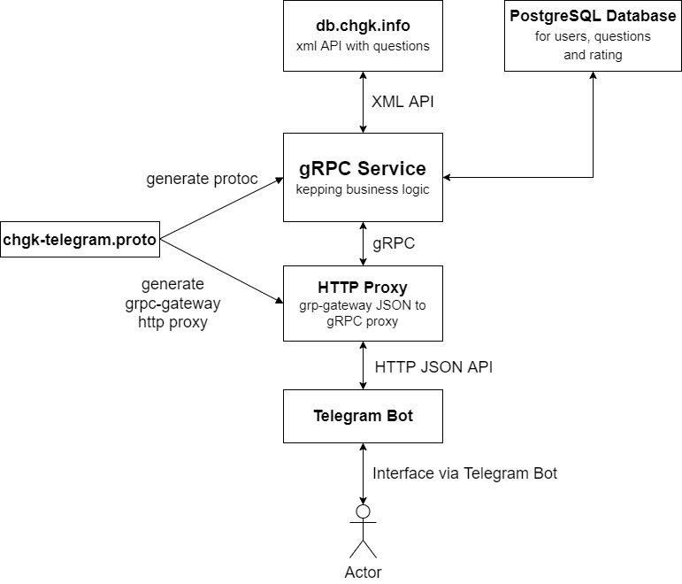

## Homework №2 for Dmitrii Fadeev
# CHGK-Telegram-Bot
#### Available features:
1. Random questions are taken from https://db.chgk.info/
2. A user requests from bot a new question and a timer is started waiting for an answer
3. Database of users who answered correctly, possibility to ask for rating via telegram bot
## Implementation Concept

#### MVP features

1. Users(developers) will use telegram bot as a communication channel
2. Any user is able to register in telegram bot.
3. After registration a user can request for a random question taken from https://db.chgk.info/xml/random API.
4. Bot will print a random question and will start a timer waiting for an answer
5. In case of correct answer this will be added to database to keep a rating of users
6. Display top N players by quantity of questions answered correclty

#### Improvements for future
1. Request for a question after desired date. Example API: http://db.chgk.info/xml/random/from_2012-01-01/limit1
2. View your history of questions answered correctly
3. View your position in top
4. Create internal database of questions pulled from https://db.chgk.info/xml API
5. "..."
